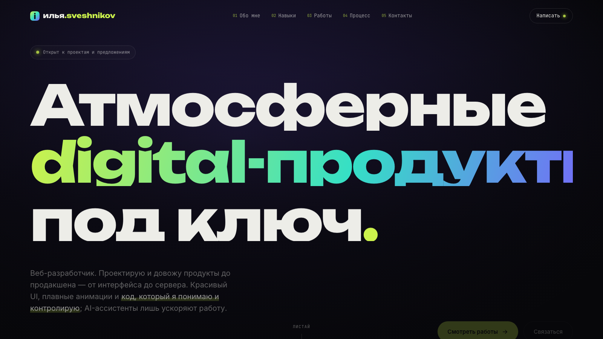

# Илья Свешников — портфолио

Атмосферный сайт-портфолио веб-разработчика на чистых **HTML / CSS / JS**: WebGL-фон,
кастомный курсор, 3D-наклон карточек и параллакс, кейсы проектов и резюме. Без сборки и зависимостей.

**🔗 Демо:** [ilyasveshnikov.github.io/MainPortfolio](https://ilyasveshnikov.github.io/MainPortfolio/) · **Резюме:** [resume.html](resume.html)



## Возможности

- 🌌 Живой **WebGL-фон** («аврора») с зерном и виньеткой
- 🖱️ Кастомный курсор, магнитные кнопки, **3D-наклон карточек**, параллакс hero
- 🗂️ Кейсы **6 проектов**: обложки, стек, фильтры и модалка с ссылками на демо и код
- 📄 Отдельная страница **резюме** + готовый PDF
- ⚡ **Без сборки** — открывается где угодно, работает на любом домене из коробки
- ♿ Доступность (skip-link, фокус, `prefers-reduced-motion`), SEO / Open Graph, JSON-LD

## Стек

`HTML` · `CSS` · `JavaScript (vanilla)` · `WebGL / GLSL` — без фреймворков и сборки.

## Запуск

```bash
python3 -m http.server 4321   # → http://127.0.0.1:4321
```

Или открыть `index.html` напрямую в браузере.

## Структура

```
index.html      сайт
resume.html     резюме (+ assets/resume.pdf)
css/style.css   стили — палитра и шрифты в начале файла
js/main.js      движок; данные проектов и профиля — в объекте SITE
assets/         скриншоты, обложки, иконка, og-image, резюме
```

## Деплой

Статический сайт — заливается на **Vercel · Netlify · GitHub Pages** или свой сервер (с HTTPS).
Дополнительной настройки не требует.

---

<sub>Сделано вручную, без шаблонов · Telegram [@ilya_svesh](https://t.me/ilya_svesh)</sub>
